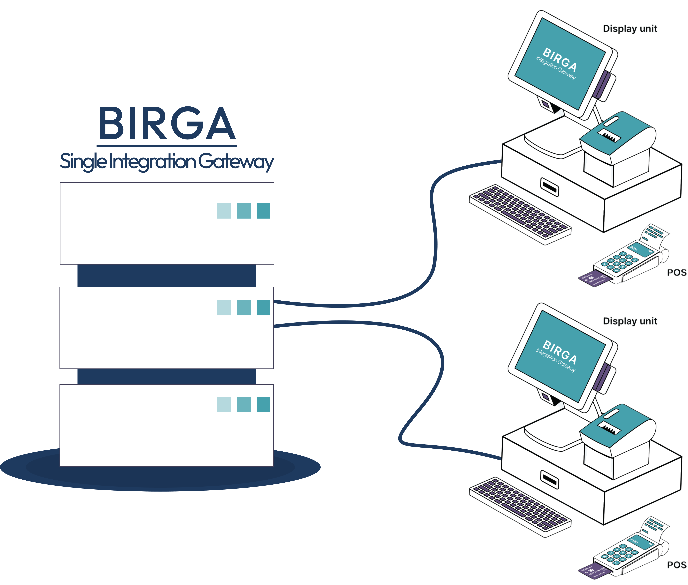

# Birga Gateway API

Birga is the single integration gateway that connects your business to multiple point-of-sale systems. One API, one dashboard, no vendor lock-in.

## What is Birga?

Birga provides a unified integration layer so your applications can talk to R-Keeper, Poster, IIKO, and other POS systems through a single, consistent interface. We handle protocols, retries, and mapping so you can focus on your product.

### Supported POS Systems

- [RKeeper](https://rkeeper.uz/)
- [Poster](https://joinposter.com/)
- [IIKO](https://iikosoftware.uz/)

## Quick Start

1. [Create a developer account](/getting-started/account)
2. [Obtain your access token](/getting-started/auth)
3. Start calling the Gateway API

See the [Getting Started](/getting-started/index) guide for a full walkthrough.

## Common Headers

All API requests require the following headers:

| Header | Required | Description |
|--------|----------|-------------|
| `Authorization` | Yes | `Bearer <access_token>` |
| `X-Request-Id` | Yes | Unique request identifier (max 255 characters) |
| `Content-Type` | Yes (POST) | `application/json` |

## Authentication

Base path: `/api/v1/auth-service`

The API uses Bearer JWT tokens for authentication. Obtain a token using your credentials, then include it in the `Authorization` header for all subsequent requests.

| Method | Endpoint | Description |
|--------|----------|-------------|
| `POST` | `/api/v1/auth-service/get-token` | Obtain access and refresh tokens using username and password |
| `POST` | `/api/v1/auth-service/refresh-token` | Refresh an expired access token |
| `POST` | `/api/v1/auth-service/validate` | Validate a token and retrieve client/user/role information |
| `POST` | `/api/v1/auth-service/logout` | Revoke the current session |

See the [Authentication](/autorization/index) section for detailed endpoint documentation.

## Gateway API

Base path: `/api/v1`

### Restaurants

| Method | Endpoint | Description |
|--------|----------|-------------|
| `GET` | `/api/v1/restaurants/get-restaurant/{restaurantId}` | Get restaurant details by ID |
| `GET` | `/api/v1/restaurants/get-restaurant-branches/{restaurantId}` | List branches for a restaurant (paginated) |
| `POST` | `/api/v1/restaurants/sync-info` | Sync restaurant info with the connected POS system |

### Branches

| Method | Endpoint | Description |
|--------|----------|-------------|
| `GET` | `/api/v1/branches/get-branch/{branchId}` | Get branch details by ID |

### Menu

| Method | Endpoint | Description |
|--------|----------|-------------|
| `GET` | `/api/v1/menus/get-menu/{branchId}` | Get menu for a branch, including categories, items, and modifiers |

### Orders

| Method | Endpoint | Description |
|--------|----------|-------------|
| `POST` | `/api/v1/orders/create-order` | Create a new dine-in order |
| `GET` | `/api/v1/orders/get-order` | Get order details by ID |
| `GET` | `/api/v1/orders/get-order-status/{orderId}` | Check current order status |
| `GET` | `/api/v1/orders/get-order-list` | List orders for a branch (paginated) |
| `POST` | `/api/v1/orders/cancel-order` | Cancel an existing order |

### Delivery

| Method | Endpoint | Description |
|--------|----------|-------------|
| `POST` | `/api/v1/delivery/create-order` | Create a delivery order |

## Need Help?

- [FAQ](/getting-started/faq) — Common questions about integration
- [Changelog](changelog) — Latest updates and releases
- Contact: [gicorp.work@gmail.com](mailto:gicorp.work@gmail.com) | Telegram: [@islomcodes](https://t.me/islomcodes)
